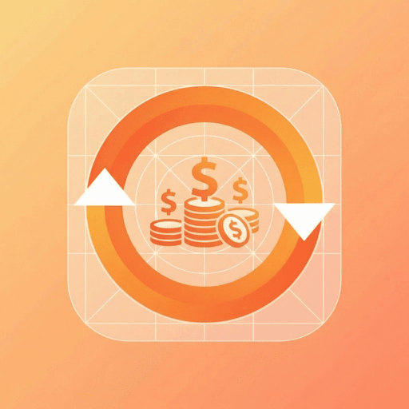

<div align="center">

  

  # Catat Cuan 📱💰

  **Aplikasi Pencatatan Keuangan Pribadi dengan AI Smart Scan**

  [](https://flutter.dev)
  [](https://dart.dev)
  [](https://riverpod.dev)
  [](https://developers.google.com/ml-kit)
  [](LICENSE)
  [](https://flutter.dev/multi-platform)
  [](docs/guides/SOLID.md)
  [](https://github.com/MashudiSudonym/Catat-Cuan)

  [English](#english) | [Indonesia](#indonesia)

</div>

---

<a id="indonesia"></a>

## Indonesia

### 🌟 Mengapa Catat Cuan?

**"Uang sering terasa bocor tanpa jelas ke mana?"**

Catat Cuan hadir untuk memberikan **kendali sadar** atas keuangan pribadimu. Bukan sekadar mengetahui saldo akhir, tapi memahami **pola pengeluaran** dan mendapatkan **insight nyata** untuk mengoptimalkan keuanganmu.

---

### ✨ Fitur Utama

#### 🤖 **AI Smart Scan - Pindai Struk dengan Kecerdasan Buatan!**
> "Dari buka kamera sampai nominal terisi ≤ 30 detik - Powered by On-Device AI"

- **Neural Network Text Recognition** - Google ML Kit untuk membaca struk dengan akurasi tinggi
- **Smart Amount Detection** - AI mengenali pola "Total", "Jumlah", "Grand Total"
- **Multi-Format Support** - Mengenali format mata uang Indonesia (Rp 50.000, 50.000, dll)
- **100% On-Device** - Privasi terjaga, data tidak dikirim ke server

#### 💸 **Pencatatan Transaksi Tanpa Batas**
- **Unlimited transactions** - catat sebanyak apapun
- **Input manual cepat** - selesai dalam ≤ 20 detik
- **Kategorisasi fleksibel** - atur kategori sesuai kebutuhanmu

#### 📊 **Dashboard & Insight Bulanan**
- **Ringkasan bulanan**: Total pemasukan, pengeluaran, dan saldo
- **Top kategori** dengan persentase & visualisasi chart
- **AI-Powered Recommendations** - Insight personal dari pola pengeluaranmu

#### 🏷️ **Manajemen Kategori Penuh**
- **Kategori default** siap pakai
- **Custom kategori** dengan warna & icon
- **Drag & drop reorder** - atur urutan sesuai preferensi

#### 🎨 **Desain Glassmorphism Modern**
- **UI frosted glass** dengan tema orange
- **Responsive design** - mobile, tablet, desktop
- **Smooth animations** - pengalaman premium

---

### 🚀 Teknologi & Arsitektur

#### Tech Stack (Updated)
| Komponen | Teknologi | Versi |
|----------|-----------|-------|
| **Framework** | Flutter | 3.5+ |
| **Bahasa** | Dart | 3.5+ |
| **State Management** | Riverpod | 3.3.1 (with @riverpod) |
| **Immutable Data** | Freezed | 3.2.5 |
| **Navigation** | GoRouter | 17.1.0 |
| **Database** | SQLite | SchemaManager v2 |
| **🤖 AI/ML** | Google ML Kit | 0.15.1 (On-Device) |

#### Clean Architecture dengan 100% SRP Compliance
```
┌─────────────────────────────────────────────────────────────┐
│                    PRESENTATION LAYER                       │
│  (Providers, Screens, Widgets, Controllers, Utils)         │
│                     ↓ depends on ↓                          │
│                    DOMAIN LAYER                            │
│  (Entities, UseCases, Repository Interfaces) ← ABSTRACTIONS │
│                     ↑ implemented by ↑                      │
│                    DATA LAYER                              │
│  (Repository Implementations, DataSources) ← CONCRETE      │
└─────────────────────────────────────────────────────────────┘
```

**Repository Segregation Pattern:**
- **Category**: 4 interfaces (Read, Write, Management, Seeding)
- **Transaction**: 6+ interfaces (Read, Write, Query, Search, Analytics, Export)

---

### 📦 Quick Start

```bash
# Clone repository
git clone https://github.com/MashudiSudonym/Catat-Cuan.git
cd Catat-Cuan

# Install dependencies
flutter pub get

# Generate code (Riverpod/Freezed)
flutter pub run build_runner build --delete-conflicting-outputs

# Run application
flutter run
```

---

### 🧪 Testing & Quality

- **Tests**: 791/791 passing ✅
- **SRP Compliance**: 100% (16/16 violations addressed)
- **Analyzer Errors**: 0 ✅

```bash
flutter test
flutter test --coverage
```

---

### 📚 Documentation (Comprehensive)

**⭐ START HERE:** [AI_ASSISTANT_GUIDE.md](./docs/AI_ASSISTANT_GUIDE.md)

#### Technical Guides (English)
- [ARCHITECTURE.md](./docs/guides/ARCHITECTURE.md) - Clean Architecture dengan real examples
- [RIVERPOD_GUIDE.md](./docs/guides/RIVERPOD_GUIDE.md) - Riverpod 3.3.1 patterns
- [FREEZED_GUIDE.md](./docs/guides/FREEZED_GUIDE.md) - Freezed 3.x (⚠️ abstract keyword required)
- [CODING_STANDARDS.md](./docs/guides/CODING_STANDARDS.md) - File naming & conventions
- [SOLID.md](./docs/guides/SOLID.md) - SOLID principles dengan codebase examples

#### Product Documentation
- [00-PRD.md](./docs/v1/product/00-PRD.md) - Product Requirements (Indonesian)
- [SPEC Documents](./docs/v1/product/) - Fitur spesifikasi dengan verified checklists
- [IMPLEMENTATION_STATUS.md](./docs/v1/product/IMPLEMENTATION_STATUS.md) - Status implementasi

#### Design System
- [DESIGN_SYSTEM_GUIDE.md](./docs/v1/design/DESIGN_SYSTEM_GUIDE.md) - Glassmorphism + Riverpod 3.x

#### Database
- [DATABASE_SCHEMA_ID.md](./docs/v1/database/DATABASE_SCHEMA_ID.md) - Dokumentasi skema database lengkap
- [DATABASE_SCHEMA.md](./docs/v1/database/DATABASE_SCHEMA.md) - Database schema documentation (English)

#### Project Status
- [PROJECT_STATUS.md](./docs/project/PROJECT_STATUS.md) - Status proyek (EN/ID)
- [REFACTORING_HISTORY.md](./docs/project/REFACTORING_HISTORY.md) - Perjalanan SOLID refactoring

---

### 🎯 Roadmap

#### v1.2.2 (Saat Ini) ✅
- [x] Pencatatan transaksi manual
- [x] 🤖 AI Smart Scan dengan Google ML Kit
- [x] Dashboard ringkasan bulanan
- [x] AI Analytics & recommendations
- [x] Manajemen kategori lengkap
- [x] Glassmorphism design system
- [x] Export CSV
- [x] Import CSV
- [x] Multi-select delete
- [x] Onboarding system
- [x] Currency settings (IDR/USD)
- [x] GoRouter navigation
- [x] Dark mode / Theme switching
- [x] Pagination (infinite scroll)
- [x] Full-text search

#### v1.3 (Rencana)
- [ ] Widget home screen
- [ ] Enhanced AI model untuk struk Indonesia

#### v2.0 (Mendatang)
- [ ] 💬 AI Chatbot assistant
- [ ] Cloud sync & backup
- [ ] Budgeting per kategori
- [ ] Multi-currency dengan AI prediction

---

### 🤝 Kontribusi

Kontribusi sangat welcome!

1. Fork repository
2. Buat branch fitur
3. Commit perubahan
4. Push & buat Pull Request

**Guidelines:**
- Ikuti [CODING_STANDARDS.md](./docs/guides/CODING_STANDARDS.md)
- Gunakan design system utilities
- Tulis test untuk fitur baru
- Ikuti prinsip SOLID

---

### 📝 Lisensi

Distributed under the MIT License. See `LICENSE` for more information.

---

### 📧 Kontak

- **Project**: [Catat Cuan](https://github.com/MashudiSudonym/Catat-Cuan)
- **Issues**: [GitHub Issues](https://github.com/MashudiSudonym/Catat-Cuan/issues)

---

### 🙏 Terima Kasih

**"Catat setiap rupiah, pahami setiap keputusan, capai setiap tujuan."** 💰✨

---

<a id="english"></a>

## English

### 🌟 Why Catat Cuan?

**"Money often feels like it's leaking without knowing where?"**

Catat Cuan gives you **conscious control** over your personal finances. Understand **spending patterns** and get **real insights** to optimize your finances.

---

### ✨ Key Features

- **🤖 AI Smart Scan** - Scan receipts with Google ML Kit (on-device, private)
- **💸 Unlimited Transactions** - Record as much as you want
- **📊 Monthly Dashboard** - AI-powered insights & recommendations
- **🏷️ Category Management** - Full CRUD with drag-drop reorder
- **🎨 Glassmorphism Design** - Modern, responsive UI

---

### 🚀 Tech Stack

| Component | Technology | Version |
|-----------|-----------|---------|
| Framework | Flutter | 3.5+ |
| Language | Dart | 3.5+ |
| State Management | Riverpod | 3.3.1 |
| Navigation | GoRouter | 17.1.0 |
| Database | SQLite | SchemaManager v2 |
| AI/ML | Google ML Kit | 0.15.1 |

**Architecture**: Clean Architecture with 100% SRP compliance

---

### 📚 Documentation

**⭐ [AI_ASSISTANT_GUIDE.md](./docs/AI_ASSISTANT_GUIDE.md)** - Critical rules & quick reference

**Technical Guides:**
- [ARCHITECTURE.md](./docs/guides/ARCHITECTURE.md)
- [RIVERPOD_GUIDE.md](./docs/guides/RIVERPOD_GUIDE.md)
- [FREEZED_GUIDE.md](./docs/guides/FREEZED_GUIDE.md)
- [CODING_STANDARDS.md](./docs/guides/CODING_STANDARDS.md)
- [SOLID.md](./docs/guides/SOLID.md)

**Product Docs:**
- [PRD](./docs/v1/product/00-PRD.md) - Product Requirements
- [SPECs](./docs/v1/product/) - Feature specifications
- [Status](./docs/v1/product/IMPLEMENTATION_STATUS.md) - Implementation dashboard

**Database:**
- [DATABASE_SCHEMA.md](./docs/v1/database/DATABASE_SCHEMA.md) - Complete database schema documentation
- [DATABASE_SCHEMA_ID.md](./docs/v1/database/DATABASE_SCHEMA_ID.md) - Dokumentasi skema database (Indonesian)

---

### 🤝 Contributing

Contributions welcome! Please follow [CODING_STANDARDS.md](./docs/guides/CODING_STANDARDS.md) and SOLID principles.

---

**Built with ❤️ using Flutter**

<div align="center">
  <sub>Production Ready | 100% SRP Compliance | 791/791 Tests Passing</sub>
</div>
