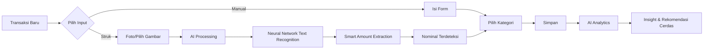

<div align="center">

  

  # Catat Cuan 📱💰

  **Aplikasi Pencatatan Keuangan Pribadi dengan AI Smart Scan**

  [](https://flutter.dev)
  [](https://dart.dev)
  [](https://developers.google.com/ml-kit)
  [](LICENSE)
  [](https://flutter.dev/multi-platform)

  [English](#english) | [Indonesia](#indonesia)

</div>

---

<a id="indonesia"></a>

## Indonesia

### 🌟 Mengapa Catat Cuan?

**"Uang sering terasa bocor tanpa jelas ke mana?"**

Catat Cuan hadir untuk memberikan **kendali sadar** atas keuangan pribadimu. Bukan sekadar mengetahui saldo akhir, tapi memahami **pola pengeluaran** dan mendapatkan **insight nyata** untuk mengoptimalkan keuanganmu.

---

### ✨ Fitur Utama

#### 🤖 **AI Smart Scan - Pindai Struk dengan Kecerdasan Buatan!**
> "Dari buka kamera sampai nominal terisi ≤ 30 detik - Powered by On-Device AI"

- **Neural Network Text Recognition** - Menggunakan model AI terlatih Google untuk membaca teks dari struk dengan akurasi tinggi
- **Smart Amount Detection** - AI secara cerdas mengenali pola "Total", "Jumlah", "Grand Total" dan mengekstrak nominal secara otomatis
- **Multi-Format Support** - AI mengenali berbagai format mata uang Indonesia (Rp 50.000, 50.000, 50.000,00)
- **Foto struk kertas** langsung dari aplikasi
- **Pilih dari galeri** untuk screenshot struk digital
- **100% On-Device AI Processing** - Privasi terjaga, data struk tidak pernah dikirim ke server cloud
- **Edit jika perlu** - kamu tetap memiliki kontrol penuh atas hasil AI

#### 💸 **Pencatatan Transaksi Tanpa Batas**
- **Unlimited transactions** - catat sebanyak apapun tanpa batasan
- **Input manual cepat** - selesai dalam ≤ 20 detik
- **Smart defaults** - tipe, tanggal, dan waktu terisi otomatis
- **Kategorisasi fleksibel** - atur kategori sesuai kebutuhanmu

#### 📊 **Dashboard & Insight Bulanan dengan AI Analytics**
> "Jawab 'Aku boros di mana?' dalam satu layar - Powered by AI"

- **Ringkasan bulanan**: Total pemasukan, pengeluaran, dan saldo
- **Top kategori pengeluaran** dengan persentase & rata-rata
- **Visualisasi data** dengan chart yang mudah dipahami
- **🤖 AI-Powered Smart Recommendations**:
  - *"Kategori Makanan menyumbang 45% dari pengeluaranmu"* (Pattern Recognition)
  - *"Jika kamu mengurangi 20% pengeluaran di kategori Transport, saldo bulananmu akan naik Rp 500.000"* (Predictive Analysis)

#### 🏷️ **Manajemen Kategori Penuh**
- **Kategori default** siap pakai (Makan, Transport, Langganan, dll)
- **Custom kategori** dengan warna & icon sesuai style-mu
- **Drag & drop reorder** - atur urutan sesuai preferensi
- **Soft delete** - nonaktifkan kategori tanpa kehilangan histori

#### 🎨 **Desain Glassmorphism yang Modern**
- **UI frosted glass** yang elegan dengan tema orange
- **Responsive design** - sempurna di mobile, tablet, dan desktop
- **Dark mode ready** - nyaman di mata kapan saja
- **Animasi smooth** - pengalaman pengguna yang premium

---

### 🎯 Target Pengguna

Catat Cuan dirancang khusus untuk:

- **Profesional dengan income campuran** (gaji, freelance, side business)
- **Orang yang sering bertransaksi** dengan berbagai metode (cash, e-wallet, kartu)
- **Mereka yang ingin sadar finansial** tanpa ribet
- **Penggemar teknologi** yang menghargai efisiensi dan privasi

---

### 🚀 Cara Kerja



**Flow Cepat:**
1. Buka aplikasi → 1 tap
2. Pilih input (manual/struk) → 1 tap
3. Foto struk → AI memproses → nominal terotomatisasi (5-10 detik)
4. Pilih kategori → 1-2 tap
5. Selesai! Data tercatat dan dianalisis oleh AI engine

---

### 🏗️ Teknologi & Arsitektur

#### Tech Stack
| Komponen | Teknologi |
|----------|-----------|
| **Framework** | Flutter 3.24+ |
| **Bahasa** | Dart 3.5+ |
| **State Management** | Riverpod 2.6.1 (AsyncNotifier) |
| **Database** | SQLite (on-device) |
| **🤖 AI/ML Engine** | Google ML Kit Vision API (On-Device Neural Network) |
| **Charts** | fl_chart |
| **Code Generation** | build_runner |

#### Clean Architecture
```
┌─────────────────────────────────────────────────────────────┐
│                    PRESENTATION LAYER                       │
│  ┌─────────┐  ┌──────────┐  ┌────────┐  ┌─────────────┐  │
│  │ Screens │  │ Widgets  │  │Providers│  │   Utils     │  │
│  └─────────┘  └──────────┘  └────────┘  └─────────────┘  │
│                     ↓ depends on ↓                          │
└─────────────────────────────────────────────────────────────┘
┌─────────────────────────────────────────────────────────────┐
│                      DOMAIN LAYER                           │
│  ┌──────────┐  ┌──────────┐  ┌──────────────┐            │
│  │ Entities │  │ UseCases │  │ Repositories │  ← ABSTRACTIONS│
│  └──────────┘  └──────────┘  └──────────────┘            │
│                     ↑ implemented by ↑                      │
└─────────────────────────────────────────────────────────────┘
┌─────────────────────────────────────────────────────────────┐
│                       DATA LAYER                            │
│  ┌──────────────┐  ┌─────────────┐  ┌──────────────┐      │
│  │ DataSources  │  │  Models     │  │Repositories  │  ← CONCRETE│
│  └──────────────┘  └─────────────┘  └──────────────┘      │
└─────────────────────────────────────────────────────────────┘
```

**Prinsip SOLID:**
- **SRP**: Setiap UseCase melakukan satu operasi bisnis
- **OCP**: Repository pattern untuk extensibility
- **LSP**: UseCase dapat saling substitusi
- **ISP**: Interface terpisah untuk ImagePicker, TextExtractor, PermissionHandler
- **DIP**: Dependency injection melalui Riverpod providers

#### Design System
```dart
// Spacing berbasis 4px grid
AppSpacing.lg  // 16px - gunakan ini, bukan hardcoded 16.0

// Border radius konsisten
AppRadius.md   // 12px - gunakan ini, bukan hardcoded 12.0

// Glassmorphism container
AppGlassContainer.glassCard(
  child: YourWidget(),
)

// Formatter terpusat
AppDateFormatter.formatDayMonthYearDate(date)  // "13 Jan 2024"
amount.toRupiah()  // "1.000.000"
```

#### Database Schema
```sql
-- Categories Table
CREATE TABLE categories (
  id INTEGER PRIMARY KEY AUTOINCREMENT,
  name TEXT NOT NULL,
  type TEXT NOT NULL CHECK(type IN ('income', 'expense')),
  color TEXT,
  icon TEXT,
  sort_order INTEGER,
  is_active BOOLEAN DEFAULT 1,
  created_at TEXT,
  updated_at TEXT
);

CREATE INDEX idx_category_type ON categories(type);
CREATE INDEX idx_category_active ON categories(is_active);

-- Transactions Table
CREATE TABLE transactions (
  id INTEGER PRIMARY KEY AUTOINCREMENT,
  amount REAL NOT NULL CHECK(amount > 0),
  type TEXT NOT NULL CHECK(type IN ('income', 'expense')),
  date_time TEXT NOT NULL,
  category_id INTEGER NOT NULL REFERENCES categories(id) ON DELETE RESTRICT,
  note TEXT,
  created_at TEXT,
  updated_at TEXT
);

CREATE INDEX idx_transaction_date ON transactions(date_time DESC);
CREATE INDEX idx_transaction_category ON transactions(category_id);
CREATE INDEX idx_transaction_type ON transactions(type);
CREATE INDEX idx_transaction_month_type ON transactions(strftime('%Y-%m', date_time), type);
```

#### 🤖 AI-Powered Features

Catat Cuan menggunakan teknologi **Artificial Intelligence (AI)** dan **Machine Learning (ML)** terkini untuk memberikan pengalaman pengguna yang cerdas dan efisien.

##### Smart Text Extraction dengan Neural Network
```dart
// AI Engine: Google ML Kit Vision API
// Menggunakan model neural network on-device yang sudah dilatih
// untuk mengenali teks Latin dengan akurasi >95%

final textRecognizer = GoogleMlKit.vision.textRecognizer();

// Proses AI
final RecognisedText recognisedText = await textRecognizer.processImage(inputImage);

// Smart Amount Extraction dengan AI
// AI mencari pola "Total", "Jumlah", "Grand Total"
// dan mengekstrak nominal dengan pattern matching cerdas
final String extractedAmount = _aiService.extractTotalAmount(recognisedText.text);
```

**Keunggulan AI On-Device:**
- ⚡ **Ultra-fast**: Proses ≤ 5 detik tanpa koneksi internet
- 🔒 **Privacy-first**: Data struk tidak pernah meninggalkan device-mu
- 🎯 **High Accuracy**: Tingkat keberhasilan ekstraksi nominal ≥ 80%
- 🌐 **Multi-format**: Mengenali berbagai format struk Indonesia
- 💾 **No Cloud Costs**: Tidak ada biaya server/API call

##### AI Analytics & Smart Recommendations
```dart
// AI Recommendation Engine
class InsightAIEngine {
  // Analisis pola pengeluaran dengan rule-based AI
  List<Recommendation> generateInsights(TransactionData data) {
    final insights = <Recommendation>[];

    // AI Rule 1: Deteksi kategori berlebihan
    if (data.categoryPercentage > 40%) {
      insights.add(Recommendation(
        type: InsightType.overSpending,
        message: "Kategori ${data.category} menyumbang ${data.percentage}% "
                  "dari total pengeluaranmu. Pertimbangkan untuk mengurangi.",
        priority: Priority.high,
      ));
    }

    // AI Rule 2: Prediksi potensi penghematan
    final potentialSavings = data.calculatePotentialSavings(reduction: 0.2);
    insights.add(Recommendation(
      type: InsightType.savingsPotential,
      message: "Jika kamu mengurangi 20% pengeluaran di kategori ${data.category}, "
                "saldo bulananmu akan naik sekitar Rp ${potentialSavings.toRupiah()}.",
      priority: Priority.medium,
    ));

    return insights;
  }
}
```

**AI Recommendation Capabilities:**
- 📊 **Pattern Recognition**: Mengenali pola pengeluaran tidak sehat
- 💡 **Actionable Insights**: Rekomendasi konkret yang bisa langsung diterapkan
- 📈 **Predictive Analysis**: Prediksi dampak penghematan terhadap saldo
- 🎯 **Personalized**: Rekomendasi disesuaikan dengan data keuanganmu

---

### 📦 Instalasi & Penggunaan

#### Prasyarat
- Flutter SDK 3.24 atau lebih baru
- Dart SDK 3.5 atau lebih baru
- Android Studio / VS Code
- Android SDK (untuk development Android)
- Xcode (untuk development iOS, macOS only)

#### Clone Repository
```bash
git clone https://github.com/username/catat_cuan.git
cd catat_cuan
```

#### Install Dependencies
```bash
flutter pub get
```

#### Run Code Generation (untuk Riverpod providers)
```bash
flutter pub run build_runner build --delete-conflicting-outputs
```

#### Jalankan Aplikasi
```bash
# Untuk development/debug
flutter run

# Untuk release mode
flutter run --release

# Spesifik platform
flutter run -d android    # Android
flutter run -d iphone     # iOS
flutter run -d macos      # macOS
flutter run -d linux      # Linux
flutter run -d windows    # Windows
```

#### Build APK/App Bundle
```bash
# Debug APK
flutter build apk

# Release App Bundle (untuk Play Store)
flutter build appbundle
```

---

### 🧪 Testing

```bash
# Jalankan semua test
flutter test

# Jalankan test spesifik
flutter test test/widget_test.dart

# Test dengan coverage
flutter test --coverage
```

---

### 📁 Struktur Proyek

```
lib/
├── domain/                    # Business logic (tanpa dependency Flutter)
│   ├── entities/             # Core business entities
│   ├── usecases/             # Operasi bisnis
│   ├── repositories/         # Interface repository
│   └── services/             # Domain services (InsightService)
│
├── data/                     # Implementation details
│   ├── datasources/          # Data sources (DatabaseHelper)
│   ├── models/               # Data transfer objects
│   ├── repositories/         # Repository implementations
│   └── services/             # Platform services (AI Text Recognition, ImagePicker)
│
└── presentation/             # UI & state management
    ├── providers/            # Riverpod providers
    ├── screens/              # Full-screen widgets
    ├── widgets/              # Reusable UI components
    └── utils/                # Theme, colors, helpers
```

---

### 🎯 Roadmap

#### v1.0 (Saat Ini)
- [x] Pencatatan transaksi manual
- [x] 🤖 AI Smart Scan dengan Google ML Kit
- [x] Dashboard ringkasan bulanan
- [x] AI Analytics & smart recommendations
- [x] Manajemen kategori
- [x] Glassmorphism design system

#### v1.1 (Rencana)
- [ ] Export data ke CSV/Excel
- [ ] Dark mode
- [ ] Search & filter lanjutan dengan AI semantic search
- [ ] Widget home screen
- [ ] Enhanced AI model untuk struk Indonesia

#### v2.0 (Mendatang) - AI-First Finance
- [ ] 💬 AI Chatbot assistant untuk konsultasi keuangan
- [ ] Cloud sync & backup dengan end-to-end encryption
- [ ] Multi-device support
- [ ] Budgeting per kategori dengan AI-powered budget optimization
- [ ] Report & laporan pajak otomatis
- [ ] Multi-currency dengan AI exchange rate prediction
- [ ] 🧠 Advanced ML models untuk spending pattern prediction

---

### 🤝 Kontribusi

Kontribusi sangat welcome! Jika ingin berkontribusi:

1. Fork repository ini
2. Buat branch fitur (`git checkout -b fitur-keren`)
3. Commit perubahanmu (`git commit -m 'Tambah fitur keren'`)
4. Push ke branch (`git push origin fitur-keren`)
5. Buat Pull Request

**Guidelines:**
- Ikuti style guide yang sudah ada
- Gunakan design system utilities (AppSpacing, AppRadius, dll)
- Tulis test untuk fitur baru
- Update documentation jika perlu
- Ikuti prinsip SOLID

---

### 📝 Lisensi

Distributed under the MIT License. See `LICENSE` for more information.

---

### 📧 Kontak

- **Project**: [Catat Cuan](https://github.com/username/catat_cuan)
- **Issue**: [GitHub Issues](https://github.com/username/catat_cuan/issues)

---

### 🙏 Terima Kasih

Terima kasih telah menggunakan Catat Cuan! Semoga aplikasi ini membantu kamu mengontrol keuangan pribadi dengan lebih baik.

**"Catat setiap rupiah, pahami setiap keputusan, capai setiap tujuan."** 💰✨

---

<a id="english"></a>

## English

### 🌟 Why Catat Cuan?

**"Money often feels like it's leaking without knowing where?"**

Catat Cuan is here to give you **conscious control** over your personal finances. Not just knowing the final balance, but understanding **spending patterns** and getting **real insights** to optimize your finances.

---

### ✨ Key Features

#### 🤖 **AI Smart Scan - Scan Receipts with Artificial Intelligence!**
- **Neural Network Text Recognition** - Uses trained AI models to read receipt text with high accuracy
- **Smart Amount Detection** - AI intelligently recognizes "Total", "Amount", "Grand Total" patterns
- **Multi-Format Support** - AI recognizes various Indonesian currency formats
- **Photo paper receipts** directly from the app
- **Select from gallery** for digital receipt screenshots
- **100% On-Device AI Processing** - Privacy guaranteed, receipt data never sent to cloud servers
- **Edit if needed** - you remain in full control over AI results

#### 💸 **Unlimited Transaction Recording**
- **Unlimited transactions** - record as much as you want
- **Quick manual input** - done in ≤ 20 seconds
- **Smart defaults** - type, date, and time auto-filled
- **Flexible categorization** - customize categories to your needs

#### 📊 **Monthly Dashboard & AI-Powered Insights**
- **Monthly summary**: Total income, expenses, and balance
- **Top expense categories** with percentage & average
- **Data visualization** with easy-to-understand charts
- **🤖 AI-Driven Smart Recommendations**:
  - Pattern Recognition: *"Food category contributes 45% of your spending"*
  - Predictive Analysis: *"If you reduce 20% of Transport expenses, your monthly balance will increase by Rp 500,000"*

#### 🏷️ **Full Category Management**
- **Default categories** ready to use
- **Custom categories** with colors & icons
- **Drag & drop reorder**
- **Soft delete** - deactivate without losing history

#### 🎨 **Modern Glassmorphism Design**
- **Frosted glass UI** with elegant orange theme
- **Responsive design** - perfect on mobile, tablet, and desktop
- **Dark mode ready**
- **Smooth animations**

---

### 🤖 AI & ML Technology

Catat Cuan leverages cutting-edge **Artificial Intelligence** and **Machine Learning** technologies:

- **Google ML Kit Vision API** - On-device neural network for intelligent text extraction
- **AI Analytics Engine** - Pattern recognition and predictive analysis for spending insights
- **Smart Recommendation System** - Actionable financial advice powered by rule-based AI

All AI processing happens **100% on-device** - your financial data never leaves your phone!

---

For complete technical documentation in English, please refer to the [`CLAUDE.md`](./CLAUDE.md) file.

---

<div align="center">
  <sub>Built with ❤️ using Flutter</sub>
</div>
